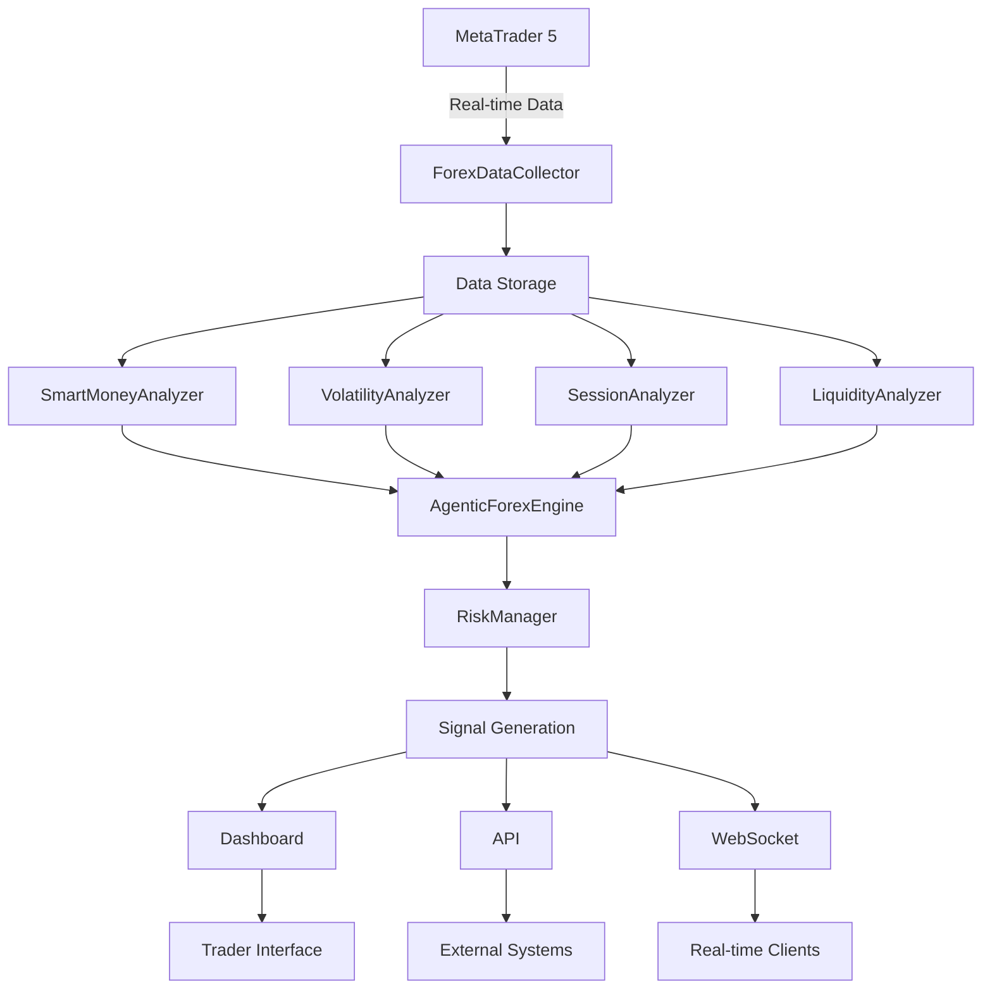

# BLOB AI Forex Engine - Project Structure

🏗️ **Complete overview of the Agentic Forex Analytics Engine architecture**

## 📁 Directory Structure

```
blob-ai-forex-engine/
├── 📄 Core Engine Files
│   ├── forex_engine.py          # Main agentic engine with SMC analysis
│   ├── config.py                # Configuration management system
│   ├── dashboard.py              # Streamlit real-time dashboard
│   ├── api.py                    # FastAPI REST API & WebSocket
│   └── start_blob_ai.py          # Master startup & control script
│
├── 📄 Setup & Documentation
│   ├── setup.py                 # Automated installation script
│   ├── requirements.txt         # Python dependencies
│   ├── README.md                # Main documentation
│   ├── INSTALL.md               # Installation guide
│   └── PROJECT_STRUCTURE.md     # This file
│
├── 📄 Testing & Examples
│   ├── test_system.py           # Comprehensive system tests
│   └── example_usage.py         # Usage examples & tutorials
│
├── 📁 Generated Directories (created at runtime)
│   ├── logs/                    # System logs
│   │   ├── startup.log
│   │   ├── forex_engine/
│   │   ├── dashboard/
│   │   └── api_server/
│   ├── data/                     # Market data storage
│   │   ├── historical/
│   │   ├── real_time/
│   │   └── analysis/
│   ├── config/                   # Configuration files
│   │   ├── trading_config.json
│   │   ├── mt5_config.json
│   │   └── api_keys.json
│   └── backups/                  # System backups
│       ├── configs/
│       └── data/
```

## 🧩 Core Components

### 1. **forex_engine.py** - The Brain 🧠
**Main agentic engine implementing institutional trading logic**

```python
Classes:
├── ForexDataCollector      # Multi-timeframe data collection
├── SmartMoneyAnalyzer      # SMC concepts (MSB, ChoCH, OB, FVG)
├── VolatilityAnalyzer      # Compression/expansion detection
├── SessionAnalyzer         # Time-based behavior analysis
├── LiquidityAnalyzer       # Pool detection & imbalance analysis
├── RiskManager            # Position sizing & risk control
└── AgenticForexEngine     # Main orchestrator

Key Features:
✅ Real-time MT5 data collection (1M to 1D timeframes)
✅ Smart Money Concepts analysis
✅ Volatility compression/expansion detection
✅ Session-based behavior patterns
✅ Liquidity pool identification
✅ Risk-adjusted signal generation
✅ Autonomous decision making
```

### 2. **config.py** - Configuration Hub ⚙️
**Centralized configuration management with presets**

```python
Configuration Classes:
├── MT5Config             # MetaTrader 5 connection settings
├── TradingConfig          # Trading parameters & risk settings
├── AnalysisConfig         # Analysis timeframes & thresholds
├── NotificationConfig     # Alert & notification settings
├── LoggingConfig          # Logging levels & file management
├── DatabaseConfig         # Data storage configuration
└── WebConfig             # Dashboard & API settings

Preset Configurations:
├── Conservative           # Low-risk, stable returns
├── Aggressive            # High-risk, high-reward
├── Scalping              # Short-term, frequent trades
├── Swing Trading         # Medium-term position holding
└── Demo Trading          # Safe testing environment
```

### 3. **dashboard.py** - Visual Interface 📊
**Real-time Streamlit dashboard for monitoring and control**

```python
Dashboard Sections:
├── 📈 Live Market Data    # Real-time price feeds & charts
├── 🎯 Trading Signals     # Current signals & recommendations
├── 📊 SMC Analysis        # Smart Money Concepts visualization
├── ⚡ Volatility Monitor  # Compression/expansion tracking
├── 🕐 Session Analysis    # Time-based behavior patterns
├── 💧 Liquidity Pools     # Pool detection & analysis
├── 📋 Trade Management    # Active positions & history
├── ⚙️ System Controls     # Configuration & settings
└── 📊 Performance Metrics # P&L, win rate, risk metrics

Interactive Features:
✅ Real-time chart updates
✅ Signal filtering & sorting
✅ Risk parameter adjustment
✅ Manual trade execution
✅ Historical analysis
✅ Performance analytics
```

### 4. **api.py** - External Integration 🔌
**FastAPI REST API and WebSocket for external systems**

```python
API Endpoints:
├── /signals              # GET current trading signals
├── /analysis             # GET market analysis data
├── /trades               # POST execute trades
├── /positions            # GET active positions
├── /history              # GET trading history
├── /performance          # GET performance metrics
├── /data/{timeframe}     # GET OHLC data
├── /health               # GET system health status
└── /ws                   # WebSocket real-time stream

Authentication:
├── API Key generation
├── JWT token support
├── Rate limiting
└── Access control
```

### 5. **start_blob_ai.py** - Mission Control 🚀
**Master control script for system management**

```python
Functionalities:
├── Service Management     # Start/stop all components
├── Health Monitoring      # Auto-restart failed services
├── Interactive Control    # Menu-driven interface
├── Log Management         # Centralized log viewing
├── System Testing         # Built-in diagnostics
├── Browser Integration    # Auto-open dashboard/docs
└── Production Deployment  # Headless mode support

Operating Modes:
├── Interactive Mode       # Full control panel
├── Headless Mode         # Background operation
├── Service Mode          # Individual service control
└── Testing Mode          # Diagnostic & validation
```

## 🔄 Data Flow Architecture



## 🧠 Smart Money Concepts Implementation

### Market Structure Analysis
```python
SMC Components:
├── Market Structure Break (MSB)
│   ├── Higher High/Lower Low detection
│   ├── Trend change identification
│   └── Momentum shift analysis
│
├── Change of Character (ChoCH)
│   ├── Impulse vs. corrective moves
│   ├── Volume profile analysis
│   └── Price action confirmation
│
├── Order Blocks (OB)
│   ├── Institutional order zones
│   ├── Supply/demand imbalances
│   └── Reaction point identification
│
├── Fair Value Gaps (FVG)
│   ├── Price inefficiency detection
│   ├── Gap measurement & classification
│   └── Fill probability analysis
│
└── Liquidity Sweeps
    ├── Stop hunt detection
    ├── False breakout identification
    └── Reversal signal generation
```

## ⚡ Volatility Intelligence

### Compression & Expansion Detection
```python
Volatility Metrics:
├── ATR (Average True Range)
│   ├── Multi-timeframe analysis
│   ├── Compression threshold detection
│   └── Expansion magnitude measurement
│
├── Standard Deviation
│   ├── Price movement consistency
│   ├── Volatility clustering
│   └── Breakout probability
│
├── Range Analysis
│   ├── Box range duration
│   ├── Consolidation strength
│   └── Breakout direction bias
│
└── Volume Integration
    ├── Volume-price relationship
    ├── Accumulation/distribution
    └── Institutional activity detection
```

## 🕐 Session-Based Intelligence

### Time-Aware Trading Logic
```python
Session Analysis:
├── Asian Session (00:00-09:00 GMT)
│   ├── Consolidation patterns
│   ├── Range establishment
│   └── Liquidity building
│
├── London Session (08:00-17:00 GMT)
│   ├── Volatility increase
│   ├── Trend initiation
│   └── False breakout potential
│
├── New York Session (13:00-22:00 GMT)
│   ├── Major moves
│   ├── Trend continuation
│   └── High-volume trading
│
└── Session Overlaps
    ├── London-NY overlap (13:00-17:00)
    ├── Maximum volatility periods
    └── Institutional activity peaks
```

## 💧 Liquidity Analysis

### Pool Detection & Targeting
```python
Liquidity Components:
├── External Liquidity
│   ├── Previous highs/lows
│   ├── Round number levels
│   └── Technical level clusters
│
├── Internal Liquidity
│   ├── Fair value gaps
│   ├── Order block zones
│   └── Imbalanced price areas
│
├── Sweep Detection
│   ├── Stop hunt identification
│   ├── Liquidity grab patterns
│   └── Reversal confirmation
│
└── Target Prioritization
    ├── Distance-based scoring
    ├── Volume-weighted importance
    └── Time-decay factors
```

## 🎯 Signal Generation Logic

### Multi-Factor Decision Engine
```python
Signal Criteria:
├── Structure Confirmation
│   ├── MSB/ChoCH alignment
│   ├── Order block validation
│   └── FVG positioning
│
├── Volatility Alignment
│   ├── Compression breakout
│   ├── Expansion continuation
│   └── Range boundary respect
│
├── Session Timing
│   ├── Optimal entry windows
│   ├── Volatility expectations
│   └── Institutional activity
│
├── Liquidity Targeting
│   ├── Clear target identification
│   ├── Risk-reward optimization
│   └── Stop placement logic
│
└── Risk Management
    ├── Position sizing
    ├── Maximum drawdown limits
    ├── Correlation analysis
    └── Portfolio exposure
```

## 🔧 Configuration System

### Flexible Parameter Management
```python
Configuration Hierarchy:
├── Default Settings
│   ├── Conservative base parameters
│   ├── Safe risk limits
│   └── Standard timeframes
│
├── Preset Configurations
│   ├── Trading style optimization
│   ├── Risk profile matching
│   └── Market condition adaptation
│
├── User Customization
│   ├── Parameter fine-tuning
│   ├── Personal preferences
│   └── Strategy modifications
│
└── Dynamic Adjustment
    ├── Market condition adaptation
    ├── Performance-based optimization
    └── Real-time parameter updates
```

## 📊 Performance Monitoring

### Comprehensive Analytics
```python
Metrics Tracking:
├── Trading Performance
│   ├── Win rate & profit factor
│   ├── Average R-multiple
│   └── Maximum drawdown
│
├── System Performance
│   ├── Signal accuracy
│   ├── Execution latency
│   └── Data feed reliability
│
├── Risk Metrics
│   ├── Value at Risk (VaR)
│   ├── Sharpe ratio
│   └── Sortino ratio
│
└── Operational Metrics
    ├── Uptime monitoring
    ├── Error rate tracking
    └── Resource utilization
```

## 🚀 Deployment Options

### Flexible Deployment Strategies
```python
Deployment Modes:
├── Local Development
│   ├── Full interactive access
│   ├── Real-time debugging
│   └── Configuration testing
│
├── VPS Production
│   ├── 24/7 operation
│   ├── Low-latency execution
│   └── Reliable connectivity
│
├── Cloud Deployment
│   ├── Scalable resources
│   ├── High availability
│   └── Managed services
│
└── Containerized
    ├── Docker deployment
    ├── Kubernetes orchestration
    └── Microservices architecture
```

## 🔒 Security & Risk Management

### Multi-Layer Protection
```python
Security Measures:
├── API Security
│   ├── Authentication & authorization
│   ├── Rate limiting
│   └── Input validation
│
├── Trading Security
│   ├── Position size limits
│   ├── Maximum drawdown stops
│   └── Emergency shutdown
│
├── Data Security
│   ├── Encrypted storage
│   ├── Secure transmission
│   └── Access logging
│
└── Operational Security
    ├── System monitoring
    ├── Anomaly detection
    └── Incident response
```

## 📈 Future Enhancements

### Roadmap & Extensions
```python
Planned Features:
├── Multi-Asset Support
│   ├── Additional currency pairs
│   ├── Commodities integration
│   └── Index trading
│
├── Advanced AI
│   ├── Machine learning models
│   ├── Neural network integration
│   └── Reinforcement learning
│
├── Social Trading
│   ├── Signal sharing
│   ├── Performance leaderboards
│   └── Copy trading features
│
└── Mobile Integration
    ├── Mobile app development
    ├── Push notifications
    └── Remote monitoring
```

## 🎓 Learning Resources

### Educational Materials
```python
Learning Path:
├── Smart Money Concepts
│   ├── ICT methodology
│   ├── Order flow analysis
│   └── Institutional behavior
│
├── Technical Analysis
│   ├── Price action trading
│   ├── Volume analysis
│   └── Market structure
│
├── Risk Management
│   ├── Position sizing
│   ├── Portfolio theory
│   └── Behavioral finance
│
└── System Development
    ├── Python programming
    ├── API integration
    └── System architecture
```

---

## 🎯 Quick Reference

### Essential Commands
```bash
# Start the system
python start_blob_ai.py start

# Run in background
python start_blob_ai.py headless

# Check system status
python start_blob_ai.py status

# Run tests
python test_system.py

# View examples
python example_usage.py
```

### Key URLs
- **Dashboard**: http://localhost:8501
- **API**: http://localhost:8000
- **Documentation**: http://localhost:8000/docs
- **Health Check**: http://localhost:8000/health

### Important Files
- **Main Engine**: `forex_engine.py`
- **Configuration**: `config.py`
- **Startup Script**: `start_blob_ai.py`
- **Installation**: `setup.py`
- **Documentation**: `README.md`

---

**🚀 Ready to dominate the Forex markets with institutional-grade intelligence!**

*This system represents the cutting edge of algorithmic trading, combining Smart Money Concepts with modern software architecture to create a truly agentic trading engine.*